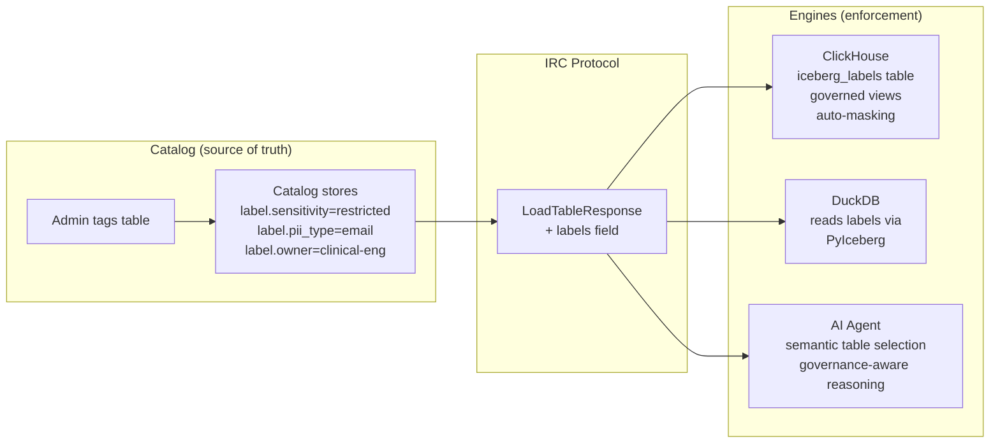
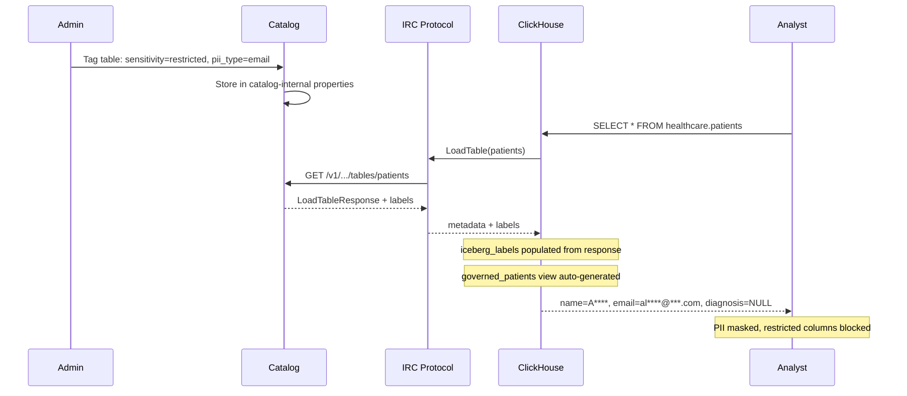

# IRC Labels — Catalog Metadata Enrichment for Iceberg

**Proposal**: Add an optional `labels` field to `LoadTableResponse` in the Iceberg REST Catalog protocol, giving catalogs a standard way to surface operational context — ownership, classification, cost attribution, semantic hints — without modifying table state.

**Why**: Catalogs maintain rich metadata about tables (who owns it, how it's classified, what it means) but have no standard way to communicate this to engines via IRC. Labels fill that gap — ephemeral, catalog-scoped, backward compatible.

**This repo** contains the end-to-end proof-of-concept: spec change, client support, catalog implementations, and demo notebooks showing real use cases.

## Proposal & Implementations

| Component | PR | What |
|-----------|------|------|
| **Spec** | [apache/iceberg#15750](https://github.com/apache/iceberg/pull/15750) | OpenAPI YAML + Python model<br/>`Labels` and `ColumnLabels` schemas in `LoadTableResult` |
| **Client** | [apache/iceberg-python#3191](https://github.com/apache/iceberg-python/pull/3191) | PyIceberg client support<br/>`table.labels`, `table.table_labels`, `table.column_labels` |
| **Catalog: Polaris** | [apache/polaris#4048](https://github.com/apache/polaris/pull/4048) | Labels from `internalProperties`<br/>Catalog-scoped, not Iceberg table metadata |
| **Catalog: Unity Catalog** | [unitycatalog/unitycatalog#1417](https://github.com/unitycatalog/unitycatalog/pull/1417) | Labels from `uc_properties` table<br/>Catalog-scoped entity properties |
| **Catalog: Lakekeeper** | [lakekeeper/lakekeeper#1676](https://github.com/lakekeeper/lakekeeper/pull/1676) | Labels from namespace properties<br/>PostgreSQL-backed, inherited by all tables |
| **E2E Demo** | [this repo](https://github.com/laskoviymishka/irc-labels) | Notebooks, proxy, AI agent, governance engine<br/>ClickHouse trusted engine demo |

Three catalogs, two languages (Java + Rust). The pattern is the same everywhere: filter catalog-internal properties by `label.*` prefix → surface as labels in `LoadTableResponse`.

## How It Works



Labels are **ephemeral catalog enrichment** — they exist only in the API response, not in table metadata files. No commits, no snapshots, no versioning. Different catalogs serving the same table return different labels.

## Use Cases

Labels are a general-purpose metadata channel in IRC. Every team uses them differently:

- **Ownership** — `owner_team`, `tier` → incident routing, on-call automation
- **Discovery** — `domain`, `description`, `data_quality_score` → self-documenting tables, catalog search
- **AI Agents** — column `meaning`, `semantic_type` → agents pick the right table, understand what columns mean
- **FinOps** — `cost_center`, `sla_tier` → cost attribution without table commits
- **Governance** — `sensitivity`, `pii_type`, `regulatory_scope` → each engine reads labels and enforces its own policies

Because labels travel through the standard IRC protocol, they enable a **trusted engine architecture**: the catalog carries classification, each engine implements and enforces its own policies based on the same labels. No runtime coordination, no catalog-to-catalog sync.

### Governance: Trusted Engine Architecture

The governance demo uses ClickHouse as a trusted engine with native enforcement:



## Demo Notebooks

### [`demo.ipynb`](notebook/demo.ipynb) — General Use Cases
- **Part 1**: Labels in the IRC protocol
- **Part 2**: Ownership tracking — machine-readable, always current
- **Part 3**: Discovery metadata — find tables by domain, tier; auto-generate data dictionary
- **Part 4**: AI agent — semantic table selection using labels
- **Part 5**: Operational / FinOps — cost attribution, SLA monitoring

### [`governance.ipynb`](notebook/governance.ipynb) — Governance via Trusted Engine
- **Part 1**: Raw data problem — PII fully exposed
- **Part 2**: `iceberg_labels` table — labels queryable in SQL
- **Part 3**: Label-driven governance — one function call generates governed views
- **Part 4**: Analyst vs admin — same table, different access (side-by-side)
- **Part 5**: Compliance inventory — HIPAA/SOX audit in pure SQL
- **Part 6**: Governance-aware AI agent — routes queries through governed views

## Quick Start

```bash
docker-compose up -d
# Open http://localhost:8888 (token: demo)
```

## Scenario: Healthcare Data Lake

| Table | Sensitivity | Regulation | Labels | Governed View |
|-------|------------|------------|--------|---------------|
| `patients` | restricted | HIPAA | pii_type on 4 columns, phi_type on diagnosis | email masked, name masked, diagnosis blocked |
| `visits_summary` | low | — | domain, tier, quality score | pass-through (no masking) |
| `billing` | medium | SOX | cost_center, sensitivity on amount | amount visible, patient_id masked |

## Stack

- **UC OSS** — Iceberg REST Catalog
- **Labels Proxy** — FastAPI, enriches IRC responses with labels
- **ClickHouse** — OLAP engine with RBAC, masking, governed views
- **DuckDB** — Embedded engine, reads via IRC
- **PyIceberg** — Python client with `table.labels` support (forked)
- **AI Agent** — Vendor-neutral LLM (Claude, OpenAI, Ollama)

## License

Apache 2.0
